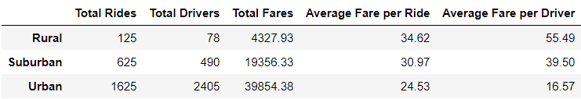
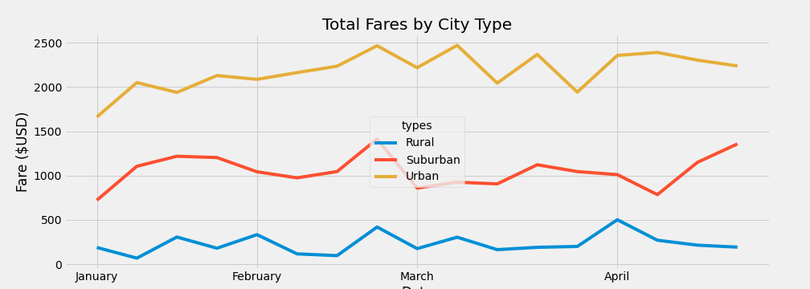

# PyBer_Analysis

## Overview of the analysis

This project compares PyBer ride-sharing data across different types of cities in 2019. To complete the analysis, I looked at differences in the number of drivers, number of rides, and fares for urban, suburban, and rural cities. Finally, I calculated the weekly fare totals for the different city types.

## Results

My analysis of PyBer ride share data produced the following results:

- Total rides, drivers, and fares:
  - Urban cities had the most total rides, highest number of total drivers, and highest total fares.
  - Suburban cities trailed urban areas in all three categories, with fewer rides, drivers, and lower total fares.
  - Finally, rural cities had the lowest totals in these categories.

- Average fares per ride and average fares per driver decreased as the total number of rides decreased. Rural cities had the highest average fares, followed by suburban cities. The lowest totals belonged to urban cities.

A summary of results by city type can be found on the following dataframe:

The following figure shows weekly fare totals for the different city types for January-April 2019.

## Summary

Based on this analysis, I can present the following recommendations:

- Urban cities produce the most total rides and highest total fares, but have the lowest average fares of the three city types. Because of the high demand for ride shares in urban cities, increasing fares in these areas might increase total revenue.
- Rural cities have the fewest rides and number of drivers and the lowest total fares, but the highest average fares. Lowering fares in rural cities could potentially introduce more customers to the service and lead to increased growth in these areas.
- Finally, suburban results fall in between those for urban and rural cities. Any adjustment to suburban fares should be minor.